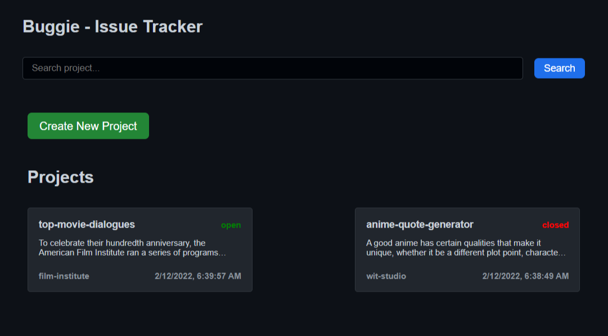
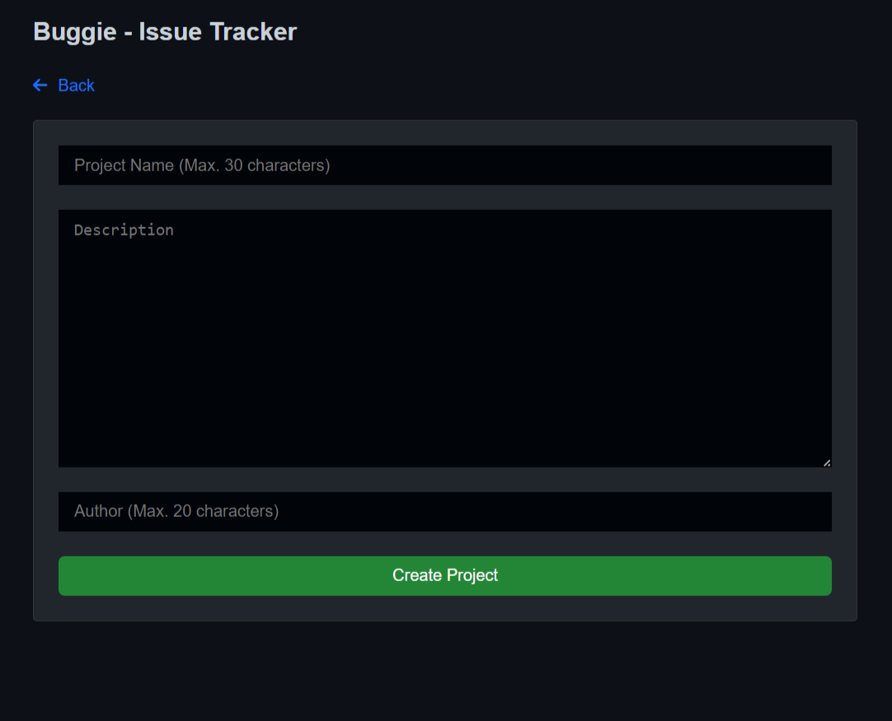
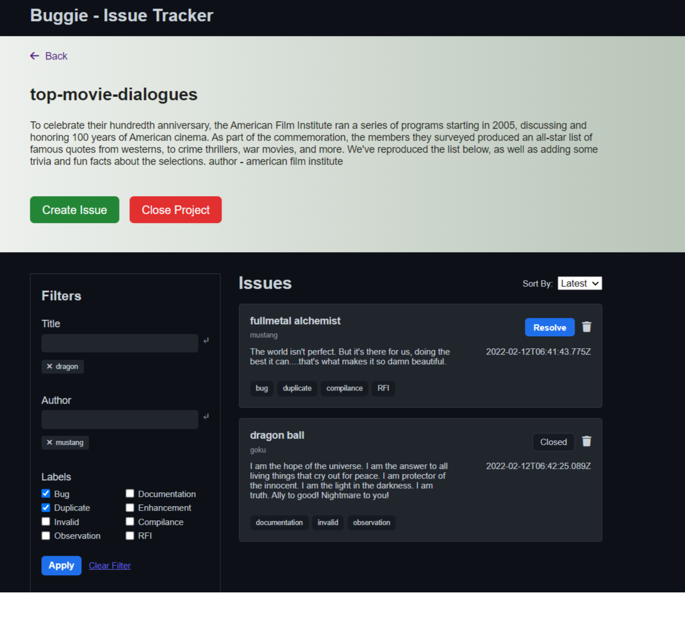

# Buggie - A Project Issue Tracker

## Application to track issues/bugs for a project.

### Youtube Link - <a href='https://youtu.be/7bl9IwnBh9Q'>Issue Tracker Demo</a>

## Features

### Home Page

- Show a list of projects.
- Give a button to create a new Project (On creating a new project it should
  appear in the list)

### Create Project Page

- Accept the following fields to create a project
  - Name
  - Description
  - Author

### Project Detail Page

- When the user clicks on a project (in home page) redirect the user to this
  page which will show bugs related to this project
- User should be able to perform following actions on this page
  - Filter by multiple labels i.e. I should be able to filter by 2 or more
    labels at the same time
  - Filter by author
  - Search by title and description
- A button to create an issue

### Create Issue Page

- User should be able to create an issue for a project
- Accept the following fields
  - Title
  - Description
  - Labels (multiple labels can be added to a project)
  - Author
